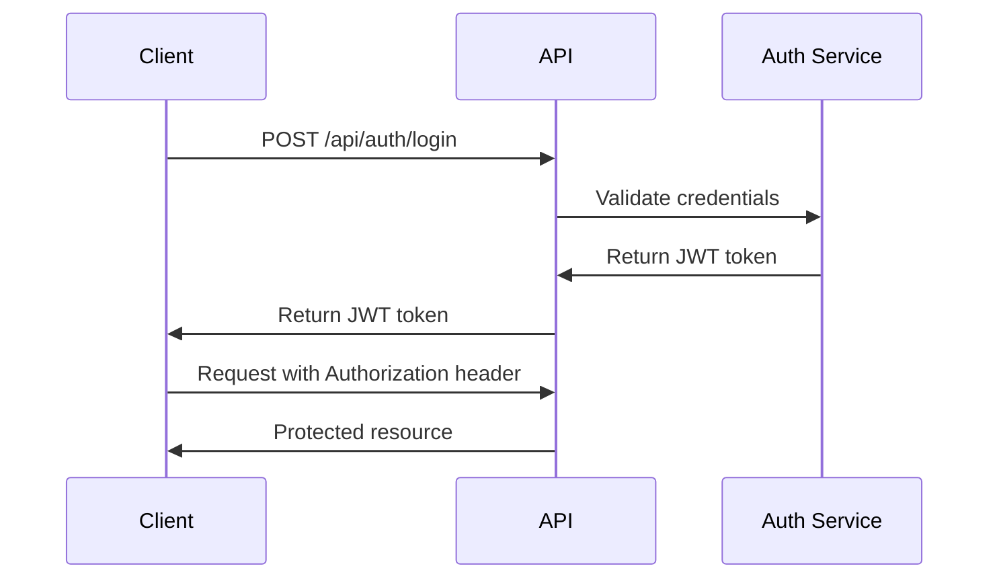

# PlayEra API Documentation

## Overview

PlayEra is a comprehensive sports venue booking platform that provides a complete API for managing venues, courts, bookings, equipment, payments, and user management. This document provides detailed information about accessing and using the API documentation.

## Accessing the API Documentation

### Swagger UI
The interactive API documentation is available at:
- **Local Development**: http://localhost:8080/swagger-ui.html
- **Production**: https://your-domain.com/swagger-ui.html

### OpenAPI Specification
The raw OpenAPI specification is available at:
- **Local Development**: http://localhost:8080/api-docs
- **Production**: https://your-domain.com/api-docs

## API Base URL

- **Local Development**: http://localhost:8080/api
- **Production**: https://your-domain.com/api

## Authentication

The PlayEra API uses JWT (JSON Web Token) authentication for secure access to protected endpoints.

### Getting a JWT Token

1. **Register a new user** (if you don't have an account):
   ```
   POST /api/auth/register
   ```

2. **Login to get JWT token**:
   ```
   POST /api/auth/login
   ```

3. **Use the token** in subsequent requests:
   ```
   Authorization: Bearer <your-jwt-token>
   ```

### Authentication Flow



## API Endpoints Overview

### 1. Authentication & User Management
- **POST** `/api/auth/register` - User registration
- **POST** `/api/auth/login` - User login
- **POST** `/api/auth/forgot-password` - Password recovery
- **POST** `/api/auth/reset-password` - Password reset
- **POST** `/api/auth/logout` - User logout

### 2. Venue Management
- **GET** `/api/venues` - List all venues with filtering
- **GET** `/api/venues/{id}` - Get venue by ID
- **POST** `/api/venues` - Create new venue
- **PUT** `/api/venues/{id}` - Update venue
- **DELETE** `/api/venues/{id}` - Delete venue
- **GET** `/api/venues/search` - Search venues
- **GET** `/api/venues/nearby` - Find nearby venues
- **GET** `/api/venues/owner/{ownerId}` - Get venues by owner

### 3. Court Management
- **GET** `/api/courts` - List all courts
- **GET** `/api/courts/{id}` - Get court by ID
- **POST** `/api/courts` - Create new court
- **PUT** `/api/courts/{id}` - Update court
- **DELETE** `/api/courts/{id}` - Delete court
- **GET** `/api/courts/venue/{venueId}` - Get courts by venue
- **GET** `/api/courts/available` - Get available courts

### 4. Booking Management
- **GET** `/api/bookings` - List all bookings
- **GET** `/api/bookings/{id}` - Get booking by ID
- **POST** `/api/bookings` - Create new booking
- **DELETE** `/api/bookings/{id}` - Cancel booking
- **GET** `/api/bookings/customer/{customerId}` - Get customer bookings

### 5. Equipment Management
- **GET** `/api/equipment` - List all equipment
- **GET** `/api/equipment/{id}` - Get equipment by ID
- **POST** `/api/equipment` - Create new equipment
- **PUT** `/api/equipment/{id}` - Update equipment
- **DELETE** `/api/equipment/{id}` - Delete equipment

### 6. Payment Processing
- **GET** `/api/payments` - List all payments
- **GET** `/api/payments/{id}` - Get payment by ID
- **POST** `/api/payments` - Create payment
- **POST** `/api/payments/mock-intent` - Create payment intent

### 7. Reviews & Feedback
- **GET** `/api/reviews` - List all reviews
- **GET** `/api/reviews/{id}` - Get review by ID
- **POST** `/api/reviews` - Create review
- **PUT** `/api/reviews/{id}` - Update review

## Using Swagger UI

### 1. Access the Swagger UI
Navigate to `http://localhost:8080/swagger-ui.html` in your browser.

### 2. Authenticate
1. Click on any protected endpoint (marked with a lock icon)
2. Click the "Authorize" button at the top of the page
3. Enter your JWT token in the format: `Bearer <your-token>`
4. Click "Authorize"

### 3. Test Endpoints
1. Click on any endpoint to expand it
2. Click "Try it out"
3. Fill in the required parameters
4. Click "Execute"

### 4. View Responses
- **Responses** tab shows all possible response codes
- **Examples** tab shows sample request/response data
- **Schema** tab shows the data structure

## Request/Response Examples

### User Registration
```json
POST /api/auth/register
{
  "name": "John Doe",
  "email": "john.doe@example.com",
  "password": "securePassword123",
  "phone": "+1234567890",
  "role": "CUSTOMER",
  "userType": "CUSTOMER"
}
```

### Venue Creation
```json
POST /api/venues
{
  "name": "Elite Sports Complex",
  "address": "123 Sports Street",
  "location": "Downtown",
  "description": "Premium sports facility with multiple courts",
  "contactNo": "+1234567890",
  "email": "info@elitesports.com",
  "venueType": "INDOOR",
  "maxCapacity": 100,
  "parkingAvailable": true,
  "foodAvailable": true,
  "changingRoomsAvailable": true,
  "showerAvailable": true,
  "wifiAvailable": true,
  "basePrice": 50.0
}
```

### Booking Creation
```json
POST /api/bookings
{
  "customerId": 1,
  "bookingDate": "2024-01-20",
  "startTime": "14:00:00",
  "endTime": "16:00:00",
  "duration": 2,
  "courtBookings": [
    {
      "courtId": 1,
      "timeDuration": 2
    }
  ]
}
```

## Error Handling

### Common HTTP Status Codes
- **200** - Success
- **201** - Created
- **400** - Bad Request (validation error)
- **401** - Unauthorized (missing or invalid token)
- **403** - Forbidden (insufficient permissions)
- **404** - Not Found
- **500** - Internal Server Error

### Error Response Format
```json
{
  "error": "Error message description",
  "timestamp": "2024-01-15T10:30:00Z",
  "path": "/api/venues",
  "status": 400
}
```

## Rate Limiting

The API implements rate limiting to ensure fair usage:
- **Authentication endpoints**: 5 requests per minute
- **General endpoints**: 100 requests per minute
- **Search endpoints**: 50 requests per minute

## Pagination

List endpoints support pagination with the following parameters:
- `page` - Page number (0-based)
- `size` - Page size (default: 20, max: 100)
- `sort` - Sort field and direction (e.g., `name,asc`)

Example:
```
GET /api/venues?page=0&size=10&sort=name,asc
```

## Filtering

Many endpoints support advanced filtering:

### Venue Filtering
```
GET /api/venues?location=Downtown&sportType=Basketball&minPrice=20&maxPrice=100&hasParking=true
```

### Search with Location
```
GET /api/venues/search?query=sports&location=Downtown&sportType=Tennis
```

### Nearby Venues
```
GET /api/venues/nearby?latitude=40.7128&longitude=-74.0060&radiusKm=10.0
```

## Testing the API

### Using Swagger UI
1. **Interactive Testing**: Use the "Try it out" feature in Swagger UI
2. **Request Validation**: Swagger automatically validates request parameters
3. **Response Examples**: View sample responses for each endpoint

### Using Postman
1. **Import OpenAPI Spec**: Import the `/api-docs` endpoint into Postman
2. **Environment Variables**: Set up environment variables for base URL and tokens
3. **Collection Runner**: Run automated tests on your API

### Using cURL
```bash
# Get JWT token
curl -X POST "http://localhost:8080/api/auth/login" \
  -H "Content-Type: application/json" \
  -d '{"email":"user@example.com","password":"password"}'

# Use token for protected endpoint
curl -X GET "http://localhost:8080/api/venues" \
  -H "Authorization: Bearer <your-jwt-token>"
```

## Development and Testing

### Local Development
1. Start the Spring Boot application
2. Access Swagger UI at `http://localhost:8080/swagger-ui.html`
3. Use the interactive documentation to test endpoints

### Testing with Different Users
1. **Customer Account**: Test booking, review, and loyalty features
2. **Venue Owner Account**: Test venue and court management features
3. **Admin Account**: Test administrative and moderation features

## Support and Feedback

For technical support or questions about the API:
- **Email**: dev@playera.com
- **Documentation**: https://playera.com/docs
- **GitHub Issues**: https://github.com/playera/api/issues

## Versioning

The API follows semantic versioning:
- **Current Version**: 1.0.0
- **Backward Compatibility**: Guaranteed within major versions
- **Deprecation Policy**: 6 months notice for deprecated features

## Changelog

### Version 1.0.0 (Current)
- Initial API release
- Complete venue booking system
- User authentication and management
- Payment processing integration
- Dynamic pricing system
- Loyalty program
- Review and rating system
- Equipment rental management
- Comprehensive search and filtering
- Real-time availability checking
- Push notifications and email alerts
- Analytics and reporting
- Role-based access control
- Input validation and security
- Swagger/OpenAPI documentation
